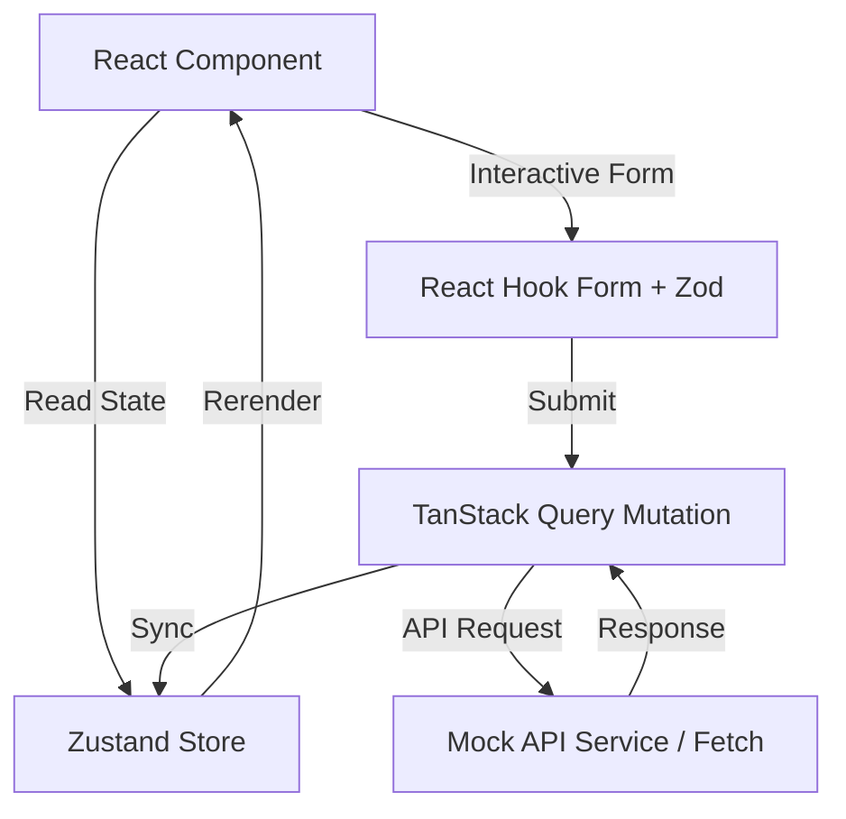

# Project Architecture - CuraLink Health

CuraLink Health is designed using a modular, scalable architecture built on Next.js 16 (App Router) and TypeScript. This document outlines the folder structure, component organization, and integration patterns.

## Directory Structure

```text
src/
├── app/                  # Next.js App Router (pages, layout, middleware)
│   ├── api/              # API endpoints (Authentication endpoints)
│   ├── dashboard/        # Role-based dashboard view subfolders (admin, doctor, patient)
│   └── login/            # Explicit Auth Login interface
├── components/           # UI and component layer
│   ├── ui/               # Reusable base elements (Buttons, Inputs, Badges, Modals)
│   ├── forms/            # Form components (validated via Zod + React Hook Form)
│   ├── charts/           # Visual analytics (Recharts implementations)
│   ├── layouts/          # Persistent components (Sidebar, PageLayout)
│   └── shared/           # Cross-cutting concerns (ErrorBoundary, Loading indicators)
├── hooks/                # Custom React hooks (hooks wrapper for queries/mutations)
├── services/             # Client-side API request layer (mock service layer)
├── lib/                  # Initializations & client settings (auth configuration)
├── store/                # Zustand global state engines (auth, appointments, etc.)
├── types/                # Unified TypeScript type declarations & interfaces
├── utils/                # Helper utilities (formatting, escaping strings)
├── constants/            # Routing configuration, menu configurations
├── providers/            # React context providers (QueryProvider, SessionProvider)
└── tests/                # Testing suite (Jest + React Testing Library)
```

## Component Architecture

To prevent duplication and maintain code quality:
1. **Base Elements (`components/ui`)**: Pure, design-system compliant components. They do not hold network state, only styling tokens and event callbacks.
2. **Forms (`components/forms`)**: Fully validated wrappers managing input bindings. They interface with React Hook Form, parsing fields using a strict Zod schema.
3. **Data Visualizations (`components/charts`)**: Client-side dynamic SVG charts. To prevent server hydration issues, these are dynamically loaded in Next.js without SSR.
4. **Layout Components (`components/layouts`)**: Sidebars, user cards, and panels providing layout and structural support.

## Data Flow Pattern



1. **State Partitioning**: Form state is kept local inside components. Cross-cutting application state (like the active session role or app configuration) is handled inside lightweight **Zustand** stores.
2. **Network Caching**: Server response models, optimistic updates, and fetch caching are managed by **TanStack Query**.
3. **Data Verification**: All external payloads are vetted using Zod models before parsing them into application state.
