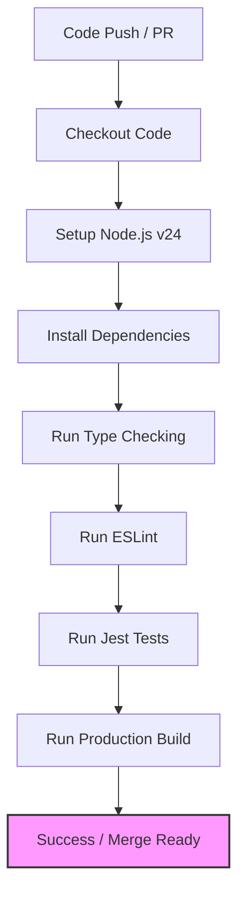

# CI/CD Setup - CuraLink Health

This document explains the automated continuous integration and continuous deployment (CI/CD) configuration designed for the CuraLink Health project.

## 1. CI/CD Workflow Overview

We have configured a GitHub Actions pipeline under [ci.yml](file:///f:/sakshant%20project/antigravityb/.github/workflows/ci.yml) that triggers automatically on any `push` or `pull_request` to the main branches (`master`, `main`).

The pipeline enforces code quality controls and guarantees that broken changes cannot be merged. It executes the following stages:

---

## 2. Pipeline Steps Detail

1. **Checkout Repository**: Pulls the code using `actions/checkout@v4`.
2. **Setup Node.js v24**: Installs the Node runtime.
3. **Cache Node Modules**: Leverages `actions/cache@v4` on the `.npm` cache directory, speeding up subsequent builds by bypassing redundant downloads.
4. **Install Dependencies**: Runs `npm install --legacy-peer-deps` to safely bypass peer conflicts associated with React 19 / Next.js 16.
5. **Run Type Checking**: Executes `npx tsc --noEmit` to validate all TypeScript types.
6. **Run ESLint**: Runs `npm run lint` (using Next.js ESLint guidelines) to check formatting and syntax standards.
7. **Run Unit Tests**: Executes `npm run test` (Jest) to verify unit assertions.
8. **Run Production Build**: Runs `npm run build` to verify page rendering, routing compilation, and bundler safety. Mock environment variables are passed to satisfy compile-time Zod validations.

---

## 3. Failure Enforcements

The pipeline is set to fail instantly on any:
* **TypeScript compilation errors** (invalid props, incorrect typings, type mismatches).
* **Linting infractions** (unused imports, broken hooks rules, illegal declarations).
* **Failing Unit Tests** (broken state store assertions, validation form bugs).
* **Next.js compilation errors** (missing pages, invalid Route Handler methods, failing static pre-render blocks).
