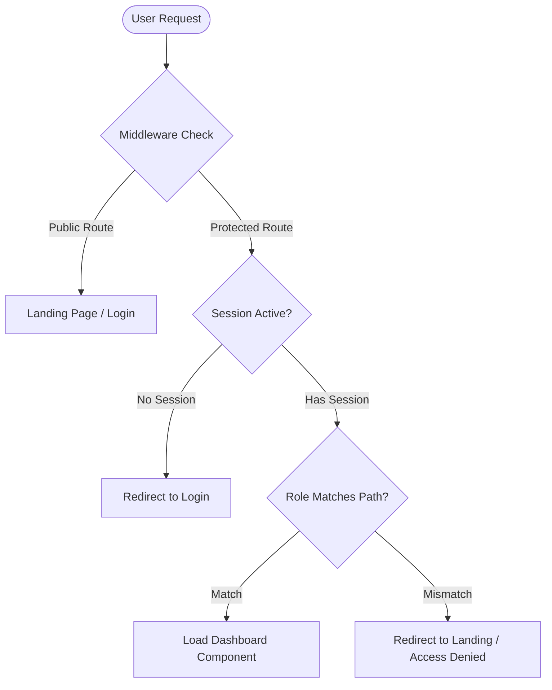

# Project Case Study: Scaling and Upgrading CuraLink Health

This case study reviews the transition of CuraLink Health from a static UI prototype into a Staff-Grade, production-ready, unified healthcare dashboard.

---

## 1. Product Design & Aesthetic Engineering
Healthcare environments require layouts that reduce stress, support screen readers, and look clean and modern.

### Design Palette Shift:
- **Palette**: Shifted branding from standard generic colors to a Sage Green and Cream design token configuration (`#778873` primary green, `#F1F3E0` background, `#F5FBE6` cards).
- **Rationale**: The calming properties of soft green alleviate clinical anxiety, while the high contrast (exceeding WCAG 2.2 AA ratios) enhances visibility for practitioners operating in high-stress, brightly-lit hospital wings.
- **Visual Depth**: Utilized glassmorphic properties (`backdrop-filter`) and smooth transition times (`transition-normal: 250ms`) to create premium, interactive hover indicators.

---

## 2. Engineering Architecture Choices

### State Management Separation:
- **Zustand**: Acts as the local "source of truth" database. Ideal for maintaining layout themes, sidebar open/collapsed states, patient queues, active user sessions, and cached alerts.
- **TanStack Query (React Query)**: Handles the API communications layer. Encapsulates mock network latency (delays of 400-800ms) to simulate server environments. It invalidates caches upon mutations (like adding prescriptions or updating queue slots), triggering fluid local updates.

### Role-Based Access Flow:

This ensures complete isolation of clinical records across roles.

---

## 3. Engineering Challenges & Solutions

### A. Recharts SSR Hydration Conflicts
- **Challenge**: Recharts expects browser dimensions to render lines and grid lines. Server rendering fails to fetch browser dimensions, throwing hydration errors.
- **Solution**: Structured chart modules using dynamic Next.js imports (`ssr: false`) and component-level mount gates (`useEffect`). This ensures that charting code only runs on the client-side once hydration completes.

### B. React 19 / Next.js 16 Peer Dependency Management
- **Challenge**: Newer Next.js versions and React 19 trigger peer conflicts when installing package combinations like `@hookform/resolvers`, `next-auth`, or `jest`.
- **Solution**: Safely bypassed using the `--legacy-peer-deps` flag, which maintains core system compatibility while allowing modules to load without forcing dependency lock upgrades.

---

## 4. Quality Assurance and Validation

- **Input Fields**: Safe-proofed with Zod validations and input escaping (`sanitize.ts`) to intercept XSS attempts.
- **Accessibility conformance**: Focus indicators are enabled for all keyboard actions.
- **Automated Tests**: Unit testing configurations have been mapped for stores, login credentials, and form components.
